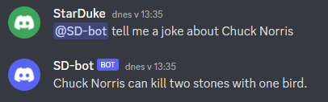

# Discord bot with Open AI Chat GTP
Just playing around with Python, Discord bot and Open AIs Chat GPT. Keys for bot and chat needs to be provided to prompt when starting script as I have no intention to deploys this bot (bot is running locally).

## Result
It seems it is working :)

  

## Links
- Open AI api key usage: https://beta.openai.com/account/usage
- Create Open AI api key: https://beta.openai.com/account/api-keys
- Open AI Python module https://beta.openai.com/docs/libraries/python-bindings
- Discord dev https://discord.com/developers/applications
- Open API words to tokens calculation https://beta.openai.com/tokenizer
- Open API documentation for completions/create method https://beta.openai.com/docs/api-reference/completions/create
## Python modules
```
pip install discord.py
pip install requests
pip install openai
```
## Notes
### Bot configuration
- temperature
  - What sampling temperature to use. Higher values means the model will take more risks. Try 0.9 for more creative applications, and 0 (argmax sampling) for ones with a well-defined answer.
- max_tokens
  - The maximum number of tokens to generate in the completion. The token count of your prompt plus max_tokens cannot exceed the model's context length. Most models have a context length of 2048 tokens (except for the newest models, which support 4096).
### Create Discord bot
- Install the Discord.py library by 'running pip install discord.py' in your command prompt or terminal.
- Create a new bot on the Discord Developer Portal and copy the token for later use.
- Create a new Python script and import the Discord.py library.
- Use the token to log in to the Discord API using the Client class from the Discord.py library.
- Create a new event listener for messages using the on_message event.
- Check if the bot is mentioned in the message and if so, use the send method to send a predefined response.
- Run the script and test the bot by mentioning it in a Discord server where it has been added.
- Keep the script running on your computer, to keep your bot online.

### Add bot to Discord server
To add your bot to a server, you will need to have the "Manage Server" permission on the server that you want to add it to.
Here are the steps to add your bot to a server:
- Go to the Discord Developer Portal and select your bot.
- Click on the "OAuth2" button in the sidebar.
- Select the "bot" scope.
- Under "Bot Permissions", select the permissions that you want your bot to have.
- Select the server you want to add the bot to from the "Server" dropdown.
- Click on the "Generate Invite Link" button.
- Click on the generated link to invite the bot to the selected server.

